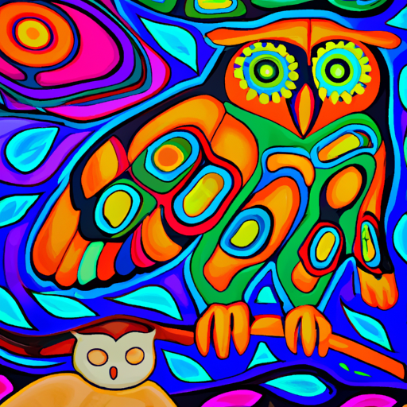

# Story Feature Overview

The `Storyteller` feature of Lnu-AI represents a blend of tradition and technology, aimed at preserving the age-old practice of storytelling in the Mi'kmaq culture while leveraging the state-of-the-art capabilities of AI. By utilizing advanced natural language processing and machine learning, the Storyteller feature creates a platform where users can interact, learn, and connect deeply with the Mi'kmaq language and culture just by entering a single word.

  

---
## Features

- **AI-Powered Narrations**: The Storyteller feature uses the Embedded Mi'kmaq Corpus and then uses AI to bring to life vibrant narratives that are richly infused with Mi'kmaq phrases, words, and concepts, creating a unique linguistic experience for users.

- **Story Sessions**: The feature allows for an engaging and interactive story sessions that randomly get selected so every story has different themes and context. 

- **Cultural Preservation**: By generating stories in both the Mi'kmaq and English language, the feature serves as an effective tool for cultural preservation, facilitating language learning and fostering a deeper appreciation of Mi'kmaq culture.

  

---

## User Guide

To use the Story feature, follow the steps below:

1. Navigate to the Story tab in the application interface.
2. Enter an English word in the Search for a word field and press Enter.
3. Listen to the pronunciation.
4. Select Generate Story button
5. The story will generate and display in the main interface.
6. Storybased images will display for the user as them images to go along as the story unfolds.

## Future Developments

We aim to continually improve the Story feature by:

- Integrating user feedback for improved AI responses.
- Expanding the database of traditional Mi'kmaq tales.
- Incorporating features for users to save their favorite AI-generated stories.

We welcome contributions from users, developers, and Mi'kmaq language enthusiasts to make this feature even more robust and effective in preserving and promoting the beautiful Mi'kmaq language. 

---

For more information on the project and other features of Lnu-AI, refer to the [Project Statement](ProjectStatement.md).

---

Developed by [Madie Laine](https://twitter.com/justmadielaine)
